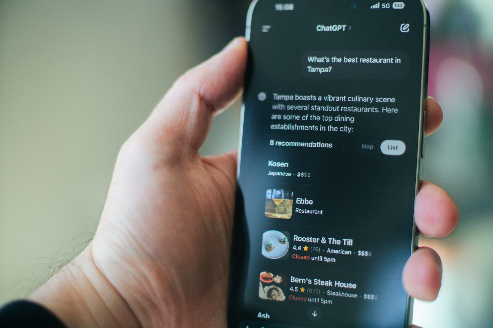
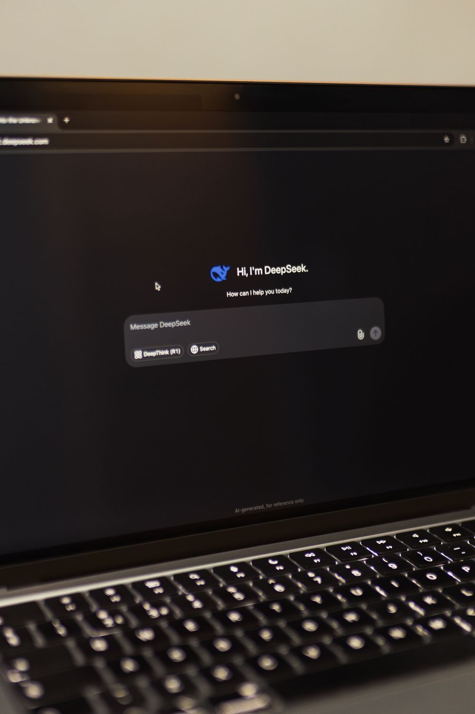

# ChatGPT supera YouTube e Amazon: l'AI riscrive la classifica di Google

**Per la prima volta nella storia, uno strumento di intelligenza artificiale — ChatGPT — diventa il termine più cercato su Google negli Stati Uniti, superando colossi come YouTube e Amazon. Con oltre 94 milioni di ricerche mensili solo in USA e quasi un miliardo di utenti attivi, l'AI non è più una tecnologia di nicchia: è la nuova porta d'ingresso al web.**

---

**Categoria**: Tecnologia · AI  
**Data**: 10 luglio 2026  

---

*Photo by Tim Witzdam on Unsplash (Unsplash License)*

---

## Il sorpasso che segna un'epoca

I numeri parlano chiaro: secondo i dati diffusi da **Ahrefs** a luglio 2026, la parola chiave "chatgpt" ha totalizzato **94,61 milioni di ricerche mensili** negli Stati Uniti, superando YouTube (86,14 milioni) e Amazon (85,77 milioni). Il dato segna un primato storico: mai prima d'ora un'applicazione di intelligenza artificiale aveva scalato la vetta delle ricerche globali su Google (fonte: Ahrefs — Top Google Searches, luglio 2026).

A livello mondiale, il dominio è ancora più netto. ChatGPT registra **841,9 milioni di ricerche mensili**, più del doppio di YouTube (390,8 milioni) e oltre quattro volte Facebook (178,5 milioni). Se si aggiunge la variante "chat gpt", che conta ulteriori 294,5 milioni di query globali, il totale supera **1,1 miliardi di ricerche mensili** — un'incredibile mole di interesse che testimonia come l'AI sia ormai entrata nel quotidiano di centinaia di milioni di persone.

---

## Crescita esponenziale: i numeri di ChatGPT

Il sorpasso nelle ricerche è solo la punta dell'iceberg. OpenAI ha registrato una crescita senza precedenti nell'ultimo anno (fonte: OpenAI, TechCrunch, CNET):

- **900 milioni di utenti settimanali attivi** a febbraio 2026, più che raddoppiati rispetto ai 400 milioni di dodici mesi prima
- **Oltre 1 miliardo di utenti mensili** raggiunto a maggio 2026 (dati Sensor Tower), il traguardo più veloce nella storia delle app consumer
- **5,51 miliardi di visite mensili** al sito web (aprile 2026)
- **2,5 miliardi di prompt** elaborati ogni giorno
- **50 milioni di abbonati** ai piani consumer a pagamento
- **25 miliardi di dollari** di revenue annualizzata (dati Reuters, marzo 2026)
- **92% delle aziende Fortune 500** utilizza già i servizi OpenAI

---

## Verso l'IPO: la corsa al trilione

L'8 giugno 2026 OpenAI ha depositato il **SEC filing confidenziale** per la sua attesissima offerta pubblica iniziale. La società, valutata **852 miliardi di dollari** post-money dopo il round di marzo 2026 (che aveva raccolto 122 miliardi), punta a superare **1 trilione di dollari** di valutazione al debutto.

I lead underwriters saranno **Goldman Sachs e Morgan Stanley**, con un possibile debutto a partire da **settembre 2026** (fonte: CNBC). La mossa arriva in un clima di forte competizione: Anthropic — la società dietro Claude — aveva depositato una settimana prima con una valutazione di 965 miliardi di dollari, mentre SpaceX si quota nei giorni successivi.

---

## Quote di mercato: ChatGPT perde terreno… ma cresce in valore assoluto

*Photo by Matheus Bertelli on Pexels (Pexels License)*

I dati **Similarweb** a maggio 2026 raccontano una dinamica apparentemente contraddittoria. La quota di ChatGPT sul traffico globale dei siti web AI generativi è scesa dal **76,4% al 52,7%** in 12 mesi, mentre Gemini è passata dall'8,9% al **27,3%** (+18,4 punti percentuali) e Claude dall'1,6% all'**8,9%** (+7,3 punti), triplicando la propria presenza (fonte: FourWeekMBA, PPC Land).

Tuttavia, il dato va letto con attenzione: ChatGPT cresce in **volume assoluto**, passando da 400 a 900 milioni di utenti settimanali. Il calo percentuale riflette l'ingresso massiccio di nuovi competitor in un mercato in rapida espansione, non una perdita di trazione del leader.

---

## AI Search Revolution: sta cambiando il modo di cercare

La rivoluzione in corso va ben oltre ChatGPT. **Google AI Mode** ha già superato i **75 milioni di utenti giornalieri**, con un impressionante **93% di zero-click rate** — gli utenti trovano la risposta direttamente nell'interfaccia AI senza cliccare su link esterni (fonte: boostN.ai, Seer Interactive).

ChatGPT domina il traffico AI con il 52,7% di quota (Similarweb), mentre **Perplexity** ha raggiunto 45 milioni di utenti attivi mensili con un ARR di 500 milioni di dollari.

Il dato che più preoccupa l'editoria tradizionale è il tasso di conversione: il traffico proveniente da piattaforme AI si converte **3-5 volte meglio** del traffico organico tradizionale. I visitatori provenienti da ChatGPT registrano un **14,2% di tasso di conversione**, contro appena il **2,8%** del traffico organico — una differenza abissale che sta ridefinendo le strategie di marketing digitale (fonte: Searchless Journal, Digital Bloom).

---

## L'editoria nel mirino: traffico in caduta libera

L'impatto sugli editori e sui creator di contenuti è stato immediato e profondo. Uno **studio randomizzato controllato** (Agarwal & Sen, 2026) ha dimostrato che la presenza di AI Overviews nei risultati di Google riduce i click organici del **39,8%** — la prima prova causale, non correlazionale (fonte: PPC Land).

I dati **Chartbeat** confermano il trend: i referral da Google sono calati del **33% a livello globale** e del **38% negli Stati Uniti** (fonte: Press Gazette). Il CTR per la prima posizione organica è crollato del **55-62%** sulle query che attivano AI Overviews, a seconda dello studio (Seer Interactive, AI Rank Lab).

Già nel 2024, **Gartner** aveva previsto un calo del 25% delle ricerche tradizionali entro il 2026, e fino al 50% entro il 2028. La realtà si è rivelata più sfumata: il volume complessivo delle ricerche non è diminuito, ma il traffico verso gli editori è crollato ben oltre le previsioni.

---

## Prospettive: cosa ci aspetta

Le proiezioni indicano che l'AI search potrebbe raggiungere **il 28% del traffico globale entro il 2027**. Google ha già trasformato il suo motore da "strumento per trovare link" a piattaforma di risposte AI generative, cannibalizzando di fatto i click verso publisher e siti tradizionali.

Il sorpasso di ChatGPT su YouTube e Amazon non è solo una curiosità statistica: è il **segnale più chiaro** che il paradigma della ricerca online sta cambiando radicalmente. L'AI non è più un assistente o un esperimento: per centinaia di milioni di persone, **è diventata la porta d'ingresso al web**.

---

## Fonti

- **Ahrefs** — Top Google Searches, luglio 2026
- **OpenAI** — Scaling AI for Everyone (report febbraio 2026)
- **TechCrunch** — ChatGPT reaches 900M weekly active users, 27/02/2026
- **CNBC** — OpenAI confidentially files for IPO, 08/06/2026
- **Bloomberg** — OpenAI valued at $852B, 31/03/2026
- **Reuters** — OpenAI tops $25B annualized revenue, 05/03/2026
- **Similarweb** — Quote mercato AI Chatbot, maggio 2026 (via FourWeekMBA, PPC Land)
- **boostN.ai** — Google AI Mode 75M users, maggio 2026
- **Seer Interactive** — AIO impact on Google CTR, 2026
- **Press Gazette** — Google referral traffic data, 2026
- **Agarwal & Sen** — Field experiment AI Overviews effect on clicks, TSE 2026
- **Gartner** — Search engine volume prediction, 2024
- **DemandSage** — ChatGPT Statistics (luglio 2026)
- **Fortune** — Anthropic files for IPO at $965B valuation, 01/06/2026
- **Searchless Journal** — AI referral traffic conversion rates benchmark, 2026

---

### Crediti immagini

- `images/chatgpt-smartphone.jpg` — Photo by Tim Witzdam on Unsplash (Unsplash License)
- `images/ai-interface-laptop.jpg` — Photo by Matheus Bertelli on Pexels (Pexels License)
