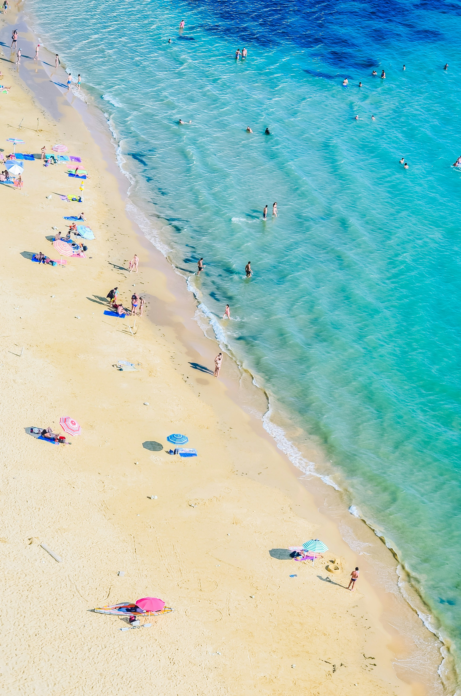

# Estate 2026: l'Italia regina d'Europa, 36 milioni di italiani in partenza tra mete low cost e viaggi con l'AI

**L'Italia guida la classifica europea del turismo con il 51,2% di saturazione delle strutture, superando Spagna e Francia. Sono 36 milioni gli italiani pronti a partire, ma la guerra in Iran e il caro-prezzi ridisegnano le rotte: crescono Albania e Montenegro, esplode il turismo di montagna trainato dalle Olimpiadi di Milano-Cortina 2026, mentre l'intelligenza artificiale conquista il 56% dei viaggiatori USA nella pianificazione delle vacanze.**

---

*Categoria: Turismo · Viaggi · Luglio 2026*

---

*Photo by Camille Minouflet on Unsplash (Unsplash License)*

---

## Italia al vertice: 51,2% di saturazione, superata la Spagna

L'estate 2026 si annuncia come un'annata storica per il turismo italiano. Secondo i dati diffusi dal Ministero del Turismo il 7 luglio 2026, l'Italia registra il **51,2% di saturazione delle strutture ricettive**, il dato più alto d'Europa. La Spagna si ferma al 42,8%, la Francia al 32,9% (fonte: ANSA, Sky TG24). Un primato che conferma il Belpaese come meta prediletta dai viaggiatori internazionali.

Le proiezioni ENIT per il 2026 parlano di oltre **480 milioni di presenze totali**, un traguardo che consolida il contributo del turismo all'economia nazionale. Il settore ha già generato un PIL di 237,4 miliardi di euro nel 2025, con stime che prevedono una crescita fino a 282,6 miliardi entro il 2035 (fonte: ENIT — BIT 2026). L'occupazione turistica rappresenta oggi il **13,2% del totale nazionale**.

A guidare la spesa dei turisti stranieri sono i tedeschi (7,5 miliardi di euro nei primi 9 mesi 2025), seguiti dagli americani (5,3 miliardi). Il Regno Unito registra un +18,5% rispetto all'anno precedente (fonte: Banca d'Italia — Indagine turismo internazionale 2025). Le principali motivazioni di viaggio restano la cultura, l'enogastronomia e l'outdoor e la natura.

---

## 36 milioni di italiani in viaggio: crescono le mete low cost

Secondo il rapporto Coldiretti/Ixè diffuso a giugno 2026, **36 milioni di italiani si apprestano a partire** per le vacanze estive. La durata media del viaggio è di 10 giorni: il 28% opta per 4-7 giorni, il 25% per 1-2 settimane, il 15% per un massimo di 3 giorni. Ben il **74% sceglie una meta europea a breve raggio** (fonte: Coldiretti, ANSA).

I dati di eDreams disegnano la classifica delle destinazioni preferite: Spagna (23%), Italia (19%) e Grecia (16%) dominano la graduatoria. La top 10 delle città più gettonate vede Barcellona, Ibiza, Olbia, Catania, Tirana, Parigi, Mykonos, Zante, Palma di Maiorca e Valencia.

Particolarmente significativa è la crescita delle mete emergenti: Torino segna un +167%, Alicante +88%, Siviglia +62%, Cagliari +56% (fonte: eDreams, Il Sole 24 Ore). L'Albania, con la sua riviera e la capitale Tirana, si conferma una delle destinazioni low cost più ambite del Mediterraneo, insieme a Montenegro e Croazia.

Sono infatti **7 milioni gli italiani che hanno rinunciato a una meta estera**, di cui il 77% per i costi proibitivi e il 18% per il timore legato ai conflitti internazionali (fonte: Coldiretti/Ixè, QuiFinanza).

---

## Caro-voli e guerra in Iran: il turismo si fa di prossimità

Il costo dei voli aerei ha registrato un incremento significativo. Secondo AFAR e AAA, le tariffe aeree domestiche USA sono aumentate del **+25%** dall'inizio 2026, mentre in Italia i rincari sulle rotte europee hanno raggiunto in media il +21%, con punte del +74% sulle destinazioni mediterranee ad agosto. Una conseguenza diretta dell'instabilità dei prezzi del carburante legata alla **guerra in Iran** (in corso da febbraio 2026, fonte: Sky TG24, eTurboNews).

Il conflitto sta ridefinendo gli equilibri del settore: secondo Expedia Group, le conversazioni relative al turismo domestico sono aumentate del 77% a livello globale (fonte: Expedia Group comunicato 21 maggio 2026). Secondo Barclays, circa un quinto dei britannici preferisce vacanze domestiche per ragioni economiche.

Il fenomeno del **turismo di prossimità** sta ridisegnando le scelte dei viaggiatori europei, che privilegiano mete raggiungibili con voli brevi o con l'auto. In questo contesto, le località italiane — dalla Sardegna alla Sicilia, dalla Puglia alle Cinque Terre — beneficiano di un flusso crescente di turisti.

---

## Montagna in festa: l'effetto Olimpiadi di Milano-Cortina

Un capitolo a parte merita il turismo montano, in forte crescita grazie all'effetto trainante delle **Olimpiadi Invernali di Milano-Cortina 2026**. Le località delle Dolomiti, del Trentino e della Valle d'Aosta registrano un aumento delle prenotazioni ben oltre la stagione invernale, con villeggiature estive all'insegna del fresco e dell'outdoor (fonte: VRetreats/Alpitour, Isnart/Unioncamere).

Località come Pila, Champoluc e le valli dolomitiche si candidano a diventare mete per tutto l'anno, attirando un turismo sportivo e naturalistico in forte espansione. Lonely Planet inserisce la **Sardegna** tra le mete imperdibili del 2026, accanto a destinazioni esotiche come il Tagikistan, la Tunisia e le Azzorre (fonte: Lonely Planet Best in Travel 2026, CNN).

---

*Photo by Michaela Římáková on Unsplash (Unsplash License)*

---

## AI e nuovi trend: la rivoluzione della pianificazione

L'estate 2026 segna anche una svolta tecnologica. Secondo il rapporto Phocuswright (The AI Surge, marzo 2026) e le previsioni Booking.com Travel Predictions 2026, il **56% dei viaggiatori statunitensi utilizza già strumenti di intelligenza artificiale** per organizzare le proprie vacanze. L'indagine di Booking.com (su oltre 29.000 viaggiatori in 33 Paesi) conferma che l'AI sta diventando un alleato sempre più presente nella pianificazione.

Ma non è solo tecnologia. L'indagine mette in luce trend sociali di grande interesse:

- **Glowcation**: l'80% dei viaggiatori si dichiara interessato a vacanze dedicate al benessere e alla cura di sé (fonte: Booking.com Travel Predictions 2026)
- **Gig tripping**: viaggi organizzati attorno a concerti e grandi eventi musicali
- **Slow travel**: in crescita la preferenza per esperienze lente, immersive e sostenibili
- **Hotel hopping**: il 54% dei viaggiatori cambia più strutture nello stesso viaggio per vivere esperienze diverse (fonte: Expedia Group Unpack '26)

I **Mondiali di Calcio 2026**, che si terranno tra Stati Uniti, Canada e Messico, stanno già ridisegnando i flussi turistici: Booking.com registra un **+289% di ricerche dall'Europa per Kansas City**, mentre Airbnb segnala un +319% di prenotazioni anno su anno (fonte: Booking.com, Airbnb). Segnale che i grandi eventi sportivi continuano a essere un potentissimo motore turistico.

---

## Prospettive: un'estate di conferme e trasformazioni

L'estate 2026 si presenta come un crocevia per il turismo italiano ed europeo. Da un lato, i numeri da record confermano la forza del settore; dall'altro, le tensioni geopolitiche e l'inflazione spingono verso modelli di viaggio più flessibili, tecnologici e responsabili.

L'Italia, con il suo primato europeo di saturazione, si trova nella posizione ideale per capitalizzare questi cambiamenti. La sfida sarà gestire i flussi in modo sostenibile — evitando l'overtourism nelle mete più gettonate — e continuare a innovare, abbracciando le nuove tecnologie senza perdere il calore umano che da sempre contraddistingue l'accoglienza italiana.

---

## Fonti

- Ministero del Turismo — Report saturazione strutture ricettive, 7 luglio 2026 (ANSA, Sky TG24)
- ENIT — Proiezioni turistiche 2026 (BIT 2026, askanews)
- Coldiretti/Ixè — Indagine sulle partenze degli italiani, giugno 2026
- eDreams — Classifica destinazioni estive 2026 (Il Sole 24 Ore)
- AFAR/AAA — Report aumento tariffe aeree 2026
- Expedia Group — Unpack '26 Summer Travel Trends, 21 maggio 2026
- Phocuswright — The AI Surge: Travel's Fastest Behavioral Shift in a Decade, marzo 2026
- Booking.com — Travel Predictions 2026
- Lonely Planet — Best in Travel 2026
- Barclays — UK Consumer Spending Report 2026
- Banca d'Italia — Indagine turismo internazionale 2025
- VRetreats/Alpitour — Impatto Olimpiadi sul turismo montano
- Airbnb — Dati prenotazioni 2026

---

### Crediti immagini

- `images/spiaggia-italiana.jpg` — Photo by Camille Minouflet on Unsplash (Unsplash License)
- `images/spiaggia-tropicale.jpg` — Photo by Michaela Římáková on Unsplash (Unsplash License)
